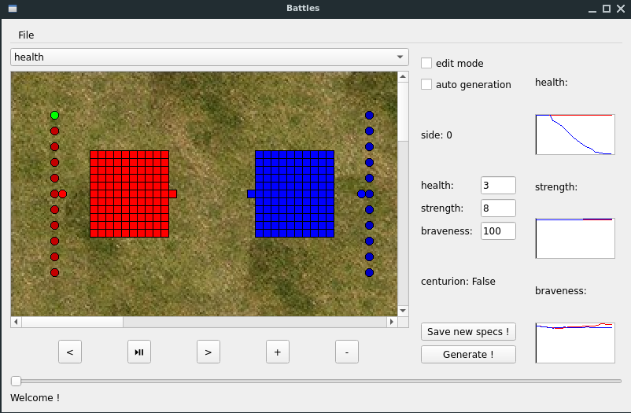

# TDLOG Project - Battles

## Getting Started

You'll need Python 3.7 with numpy and PyQt5. To start a simulation just run

```
./main.py
```
With the following option flags :<br>
-s to run the simulation<br>
-a to disable the GUI

## Features



### To explore the simulation
* To explore in time you can use the buttons below the scene and/or the slider
* To explore in space, you can use the scrollbars, or you can click on the field to move the camera. If you click on a unit, you'll be able to see its specs, but not to change them (see next section for that).
* To see more detailed curves you can click on them, a more detail plot will appear.

### To generate a new simulation
* To genereate a brand new simulation, you can use File/Generate, or you can run the program with the -s flag
* To generate a new simulation from a current state, check the "edit mode" checkbox. You can now drag'n'drop units, and change their specs (don't forget to save your modifications with the corresponding button !). When you're done, just click on the generate button.

## Authors


* **Louis Hémadou** - student at the École Nationale des Ponts et Chaussées (ENPC)
* **Louis Lesueur** - student at the École Nationale des Ponts et Chaussées (ENPC)
* **François Medina** - student at the École Nationale des Ponts et Chaussées (ENPC)

